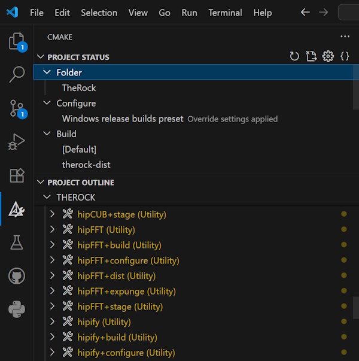
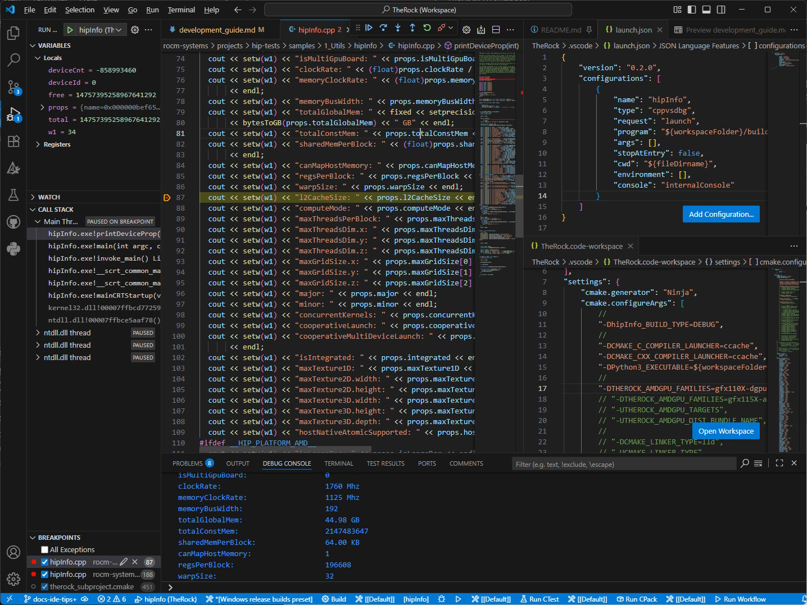

# TheRock Development Guide

While TheRock started life as a super-project for doing combined builds and releases of individual ROCm components, it has increasingly been used as an entrypoint for developing ROCm components as well, since it provides a stable, single entrypoint to iterate on any ROCm sub-project. This guide collects notes and procedures aimed at ROCm developers who wish to use TheRock as a development environment.

While there is much overlap between using TheRock as a development environment and as a CI/release platform, this document is geared at exposing features and techniques specifically targeted at making ROCm developers more productive. Since development features and approaches are built on an as-needed basis, please consider this a working document that presents approaches that have worked for core developers.

Table of contents:

- [Overall build architecture](#overall-build-architecture)
- [Single component development](#single-component-development)
- [Developer CMake flags](#developer-cmake-flags)
- [IDE support and features](#ide-support-and-features)

## Overall build architecture

TheRock provides:

- A CMake-based build for ROCm components
- A setuptools-based build for ROCm Python packages
- (Coming soon!) Scripts for producing native RPM and DEB packages
- Scripts for building projects like PyTorch and JAX


Note that at each layer of the build, developers can build from source _or_ fetch prebuilt artifacts/packages from sources like pre-commit CI workflow runs or nightly package releases.

For example:

- If you want to build PyTorch using ROCm Python packages that have already been built for your operating system and GPU architecture family, you can skip most of the source builds:

  
  

- If you want to build native packages for a Linux distribution including some source changes to ROCm components, you can build ROCm artifacts using CMake then package them for your distribution:

  
  

Most of this document focuses on the ROCm build itself, which is split into
phases for each feature group like "base", "compiler", "core", and "math-libs".

- Feature groups are roughly aligned with git superrepos (e.g.
  https://github.com/ROCm/rocm-libraries and https://github.com/ROCm/rocm-systems),
  with individual subprojects in the `projects/` subfolders
- Each subproject build _produces_ `build/`, `stage/`, and `dist/` outputs
  (see [TheRock Build System Manual - Build Directory Layout](./build_system.md#build-directory-layout))
- Each subproject build _depends on_ the `stage/` and `dist/` outputs of
  some subset of prior subproject builds


This separation between subprojects allows for incremental rebuilds and
bootstrapping from prebuilt artifacts produced by prior builds (local, from
another developer, or from CI). For example, building a subproject like
"ROCR-Runtime" can skip rebuilding the "amd-llvm" subproject by reusing build
outputs for that dependency.


## Single component development

When working on a single component, TheRock can be configured to build only a desired subset, allowing rapid iteration once the initial configure/build is done. See the *Feature Flags* in the main project README or the corresponding documentation in the top-level `CMakeLists.txt` for help in selecting a subset. As an example, this section will use the HIPIFY component to demonstrate the basic flow.

### Initial build

First, build TheRock as usual but requesting only a certain component. This is done with CMake arguments like:

```
-DTHEROCK_ENABLE_ALL=OFF -DTHEROCK_ENABLE_HIPIFY=ON
# Note that if modifying an existing build, you may also want to add
# -DTHEROCK_RESET_FEATURES=ON in order to reset any existing enable/disable
# flags to the new settings.
```

> [!TIP]
> We maintain a set of
> [CMake presets](https://cmake.org/cmake/help/latest/manual/cmake-presets.7.html)
> with useful configurations in [`CMakePresets.json`](/CMakePresets.json).
>
> Additional presets for development workflows could be added to either that
> shared file or a `CMakeUserPresets.json` file.

### Build directory layout

The `hipify` sources are in the `compiler/hipify` directory and the outer build target and CMake flags are contained in the `compiler/CMakeLists.txt` file. Once the initial configure is done, you will see a corresponding directory in your build directory. At the time of writing, this directory looks something like this:

```
$ ls -lh
total 8.0K
drwxrwxr-x 1 stella stella  272 Mar 11 19:38 build
drwxrwxr-x 1 stella stella   26 Mar 11 19:38 dist
-rw-rw-r-- 1 stella stella 3.8K Mar 11 14:56 _init.cmake
drwxrwxr-x 1 stella stella   20 Mar 11 19:38 stage
drwxrwxr-x 1 stella stella   94 Mar 11 19:38 stamp
-rw-rw-r-- 1 stella stella  465 Mar 11 14:56 _toolchain.cmake
```

These entries are explained here:

- `build`: The CMake build for the component. You can `cd` into this directory and do anything you want once the project is initially built.
- `stage`: Standalone install directory for the component. Each component is installed in isolation into its dedicated stage directory without any of its dependencies. This is kept as a pristine install tree and is never intermixed with other components. As such, the contents may not actually work (since they will be missing runtime deps, etc) but keeping this isolated aids in packaging, caching, pre-builds, etc.
- `dist`: The `stage` tree is combined with the `stage` tree of all of its transitive runtime dependencies, resulting in the minimum surface-area directory in which the installed component should be able to be used. Note that hard-links are used between the `stage` and `dist` directories, so maintaining these copies should be efficient. Be careful about changes propagating, though.
- `stamp`: This directory contains "stamp" files which help the super-project know when a component needs to be reconfigured or rebuilt. Deleting the stamp files is one way to get around issues where the super-project is not detecting sub-project changes and is therefore not incrementally building.
- `_init.cmake`: This file is generated by the super-project and CMake will include it upon encountering the first `project` command in the component (See [cmake-commands(7) >> project >> Code Injection](https://cmake.org/cmake/help/v3.31/command/project.html#code-injection) for details). This includes a variety of customizations to the build, enabling it to properly find dependencies, set up program/linker paths, etc. It also triggers inclusion of the `pre_hook_${component}.cmake` and `post_hook_${component}.cmake` files, which are used to further customize individual projects as part of the overall build.
- `_toolchain.cmake`: This file is generated by the super-project and set as the [CMAKE_TOOLCHAIN_FILE](https://cmake.org/cmake/help/latest/variable/CMAKE_TOOLCHAIN_FILE.html) for the component. This contains overrides for CMake settings that influence the compiler toolchain. Different components will have different toolchain settings (i.e. HIP projects will reference the in-tree built HIP compiler, whereas non-HIP projects will configure the host toolchain).

> [!TIP]
> See also [TheRock Build System Manual - Build Directory Layout](./build_system.md#build-directory-layout).

### Option 1: Work directly on the project

For developers who just want to use TheRock to bootstrap their development activity, after performing an initial build, they can just go into the `build` directory for their component and issue `ninja` and `cmake` commands as if it was any normal CMake project. The super-project will set everything up to defaults and the developer can make any local changes desired and iterate.

If ever needing to reset and start over (using `hipify` as the component name), just `ninja hipify+expunge` followed by `ninja hipify`. You can also choose to just run the configure or build stage with `ninja hipify+configure` or `ninja hipify+build` as desired.

If you blow away the entire component build directory, you may need to reconfigure the super-project (i.e. `cmake .` in the super-project build directory).

The following special targets are added to every sub-project:

- `therock-touch`: Deletes the `stage.stamp` file for the project, causing any future super-project build to see the project as out of date and in need of staging-install. This is added as `ALL` so that normal builds within the project (i.e. `ninja`) will leave the sub-project in an out of date state.
- `therock-dist`: Deletes the `build.stmap` file, indicating that the project needs to be rebuilt and re-installed. Then invokes `{project}+dist` in the super-project so that all artifacts and distributions that depend on this project are updated. In most cases, for incremental rebuild, `ninja therock-dist` should be all you need to ensure that the results of your build make it into the super-project `build/dist` and `build/artifacts` directory.

### Option 2: Drive from the super-project

If not doing deep development on the component, it is often effective to just use the targets exposed for each component at in the super-project and never touch the component build directory.

This can be done (using `hipify` as the example component name) with commands like this:

```
ninja hipify+expunge && ninja hipify
```

If only changing source files and not wanting to blow away the configured build directory, the expunge step is not needed: that basically deletes all intermediates and forces a reconfigure/rebuild and is the most effective way to "start over" at a component level.

### Source Management

Every component is a submodule (not strictly true: there are some small compatibility components that are directly included in TheRock repo). Use normal `git` tools for adding remotes, switching branches, applying patches, etc.

An outer level execution of `./build_tools/fetch_sources.py` will reset all submodule state and re-apply any local patches. If this results in loss of local commits, they can typically be found in the component's `git reflog`. It should not be possibly to truly lose uncommitted work, but re-fetching sources will effectively `git reset --hard`.

## Developer CMake flags

### CMake system flags

The following CMake flags are mirrored to component projects (see `THEROCK_DEFAULT_CMAKE_VARS` in `therock_subproject.cmake`):

- `CMAKE_BUILD_TYPE`
- `CMAKE_C_VISIBILITY_PRESET`
- `CMAKE_CXX_VISIBILITY_PRESET`
- `CMAKE_PROGRAM_PATH`
- `CMAKE_PLATFORM_NO_VERSIONED_SONAME`
- `Python3_EXECUTABLE`
- `Python3_FIND_VIRTUALENV`
- `THEROCK_SOURCE_DIR`
- `THEROCK_BINARY_DIR`
- `ROCM_SYMLINK_LIBS`

In addition, if a component is using the host toolchain, the following are mirrored:

- `CMAKE_C_COMPILER`
- `CMAKE_CXX_COMPILER`
- `CMAKE_LINKER`
- `CMAKE_C_COMPILER_LAUNCHER`
- `CMAKE_CXX_COMPILER_LAUNCHER`
- `CMAKE_C_FLAGS`
- `CMAKE_CXX_FLAGS`
- `CMAKE_EXE_LINKER_FLAGS`
- `CMAKE_SHARED_LINKER_FLAGS`
- `CMAKE_MSVC_DEBUG_INFORMATION_FORMAT`
- `CMAKE_INSTALL_LIBDIR`

If building with the in-tree HIP compiler, `CMAKE_C_COMPILER`, `CMAKE_CXX_COMPILER`, `CMAKE_LINKER`, `AMDGPU_TARGETS`,
`GPU_TARGETS` and `CMAKE_CXX_FLAGS_INIT` will be set accordingly.

### Per-project CMake flags

These CMake flags allow overriding the global options for individual sub-projects:

- `{project}_BUILD_TYPE`

For example, this will build the "hipBLASLt" subproject in `RelWithDebInfo` and all other projects in `Release`:

```bash
  -DCMAKE_BUILD_TYPE=Release \
  -DhipBLASLt_BUILD_TYPE=RelWithDebInfo \
```

> [!TIP]
> See the [Tips for using VSCode](#tips-for-using-vscode) section below for an
> example of how to debug programs built in this way.

### Additional CMake developer ergonomic flags

We add developer ergonomic flags as needed in order to support project-wide development activities. This currently includes:

- `THEROCK_VERBOSE`: If true, enables much more verbose CMake output. This is especially useful for diagnosing dependency and component project setup issues.
- `THEROCK_BUNDLE_SYSDEPS`: Defaults to true on Linux, resulting in the use of in-tree built dependencies for most system packages. You can build with actual system packages vs locally built versions by disabling this.

In addition, the following environment variables effect the project:

- `THEROCK_INTERACTIVE`: Sets up all build actions for `USES_TERMINAL`. This disables all background building and causes all configure/build steps to stream to the console. This can be useful for debugging tricky issues, but it is usually more convenien to just look at the log files under `build/logs/`. (TODO: Change this to a CMake cache variable as it is somewhat unwieldy as an environment variable).

### Additional build targets

#### Top-level targets:

- `artifacts`: Generates all `artifact/{...}` directories and manifests.
- `archives`: Generates `.tar.xz` archives for each artifact in the build. These can be used for uploading to CI systems, bootstrapping later builds, or packaging.
- `dist`: Builds all components and materializes the `build/dist/rocm` unified tree from all artifacts. This is setup for `ALL`, so usually just building with no arguments is sufficient.
- `expunge`: Deletes build sub-project files for configuration, builds, artifacts, and distributions (note that `clean` in the super-project is a bit counter-intuitive because it just removes stamp files, causing everything to seem as out of date. Therefore, we choose the word `expunge` to indicate that all byproducts need to be removed).

#### Per-component targets:

Each component build consists of stages: `configure > build > stage > dist`. These can be invoked directly. The `component` target just builds the `dist` stage, which includes everything.

- `component+build`: Runs the component's build stage.
- `component+configure`: Runs the component's configure stage.
- `component+expunge`: Completely removes all intermediate files for the component.
- `component+stage`: Performs component installation to the `stage/` and `dist/` directories.
- `component+dist`: Generates all artifacts and distributions that depend on files from the component project.

## IDE support and features

### Code assistance using `compile_commands.json`

In addition to generating `compile_commands.json` files within the subproject
build directories (e.g. `build/math-libs/BLAS/hipBLAS/build/compile_commands.json`),
the superproject can also generate a combined `compile_commands.json` so that
IDEs such as VSCode, with an appropriate C++ development extension, can provide
code assistance across all subprojects.

The superproject generates `compile_commands_fragment_*.json` files at the
top level for each subproject and then combines them into a single
`compile_commands.json` when the CMake `therock_merged_compile_commands` utility
target is built.

> [!NOTE]
> Since the project is quite large, this can add a significant overhead to your
> development machine, and we are still gathering experience on the best way to
> optimize this powerful feature.

```bash
λ cmake --build build --target therock_merged_compile_commands
[0/2] Re-checking globbed directories...
[1/2] Merging compile_commands.json

# See the combined file in the source directory.
λ ls . | grep compile_commands
compile_commands.json

# See the fragment and "_merged" files in the build directory.
λ stat -c "%n,%s" -- ./build/* | column -t -s, | grep compile_commands
./build/compile_commands_fragment_MIOpen.json                  3831869
./build/compile_commands_fragment_amd-comgr.json               28834
./build/compile_commands_fragment_amd-llvm.json                7782554
./build/compile_commands_fragment_hip-clr.json                 485956
./build/compile_commands_fragment_hipBLAS-common.json          0
./build/compile_commands_fragment_hipBLAS.json                 168536
./build/compile_commands_fragment_hipBLASLt.json               282725
./build/compile_commands_fragment_hipCUB.json                  172236
./build/compile_commands_fragment_hipFFT.json                  1751
./build/compile_commands_fragment_hipInfo.json                 992
./build/compile_commands_fragment_hipRAND.json                 10136
./build/compile_commands_fragment_hipSOLVER.json               99941
./build/compile_commands_fragment_hipSPARSE.json               321026
./build/compile_commands_fragment_hipcc.json                   2351
./build/compile_commands_fragment_hipify.json                  52163
./build/compile_commands_fragment_mxDataGenerator.json         0
./build/compile_commands_fragment_rocBLAS.json                 1708838
./build/compile_commands_fragment_rocFFT.json                  112420
./build/compile_commands_fragment_rocPRIM.json                 204999
./build/compile_commands_fragment_rocRAND.json                 129731
./build/compile_commands_fragment_rocSOLVER.json               1179027
./build/compile_commands_fragment_rocSPARSE.json               1719832
./build/compile_commands_fragment_rocThrust.json               208211
./build/compile_commands_fragment_rocm-cmake.json              0
./build/compile_commands_fragment_rocm-core.json               1481
./build/compile_commands_fragment_rocm-half.json               0
./build/compile_commands_fragment_therock-FunctionalPlus.json  0
./build/compile_commands_fragment_therock-aux-overlay.json     0
./build/compile_commands_fragment_therock-boost.json           0
./build/compile_commands_fragment_therock-bzip2.json           7569
./build/compile_commands_fragment_therock-eigen.json           1205192
./build/compile_commands_fragment_therock-fmt.json             1219
./build/compile_commands_fragment_therock-frugally-deep.json   0
./build/compile_commands_fragment_therock-googletest.json      7733
./build/compile_commands_fragment_therock-host-blas.json       7801703
./build/compile_commands_fragment_therock-msgpack-cxx.json     0
./build/compile_commands_fragment_therock-nlohmann-json.json   0
./build/compile_commands_fragment_therock-sqlite3.json         825
./build/compile_commands_fragment_therock-zlib.json            0
./build/compile_commands_fragment_therock-zstd.json            0
./build/compile_commands_merged.json                           18599938
```

### Tips for using VSCode

The [CMake Tools](https://marketplace.visualstudio.com/items?itemName=ms-vscode.cmake-tools)
extension can be used to configure the superproject and build individual targets:



Settings for CMake builds can be specified in `.vscode/settings.json` or a
`.vscode/*.code-workspace` file, like so:

```jsonc
{
  "cmake.generator": "Ninja",
  "cmake.configureArgs": [
    // General settings.
    "-DTHEROCK_VERBOSE=ON",
    "-DCMAKE_C_COMPILER_LAUNCHER=ccache",
    "-DCMAKE_CXX_COMPILER_LAUNCHER=ccache",
    "-DPython3_EXECUTABLE=${workspaceFolder}/.venv/Scripts/python",
    "-DTHEROCK_AMDGPU_FAMILIES=gfx110X-dgpu",  // Set to your GPU target family.
    //
    // You can include both option settings for easy toggling.
    "-DBUILD_TESTING=ON",
    // "-DBUILD_TESTING=OFF",
    //
    // Set build type for individual subprojects if you want.
    "-DhipInfo_BUILD_TYPE=DEBUG",
  ]
}
```

A `launch.json` file can be used to debug programs. For example on Windows:

```jsonc
{
  "version": "0.2.0",
  "configurations": [
    {
      "name": "hipInfo",
      "type": "cppvsdbg",
      "request": "launch",
      // TODO: Have this depend on a build action?
      "program": "${workspaceFolder}/build/dist/rocm/bin/hipInfo.exe",
      "args": [],
      "stopAtEntry": false,
      "cwd": "${fileDirname}",
      "environment": [],
      "console": "internalConsole"
    }
  ]
}
```

Here is an example of debugging that hipInfo.exe:


